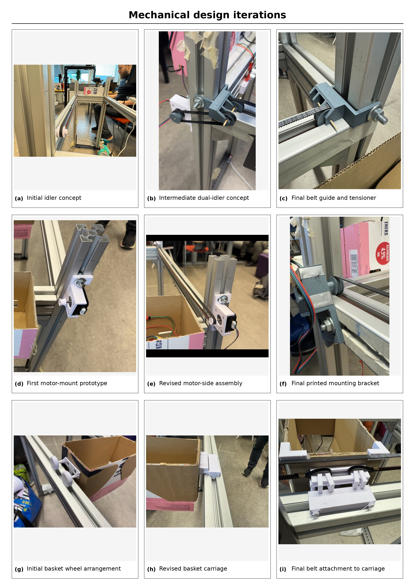

# Waste-Sorting Robot

**Advanced Project in Robotics – University of Eastern Finland, 2026**  
**Authors:** Jan Sistonen & Jermu Roivanen

A prototype robotic waste sorter that combines **computer vision, embedded control, and a custom linear sorting mechanism**. A Raspberry Pi 5 runs a fine-tuned YOLO object-detection model, maps the detected object to a waste category, moves a sorting basket to the corresponding bin position, releases the item through a servo-operated hatch, and returns the basket to its home position.

<!-- IMAGE PLACEHOLDER
Add a photo of the completed robot here, for example:

-->

## Project overview

The system was developed around a **Sense–Think–Act** architecture:

1. **Sense** – A USB camera captures the waste item and an ultrasonic sensor provides the home-position reference.
2. **Think** – A fine-tuned YOLO model identifies the object. The software extracts the waste-category prefix from the detected class name and selects the corresponding basket position.
3. **Act** – A NEMA 17 stepper motor moves the basket along the aluminium frame. A servo operates the bottom hatch to release the item, after which the basket returns to the home position.

The project focused on integrating machine learning, Raspberry Pi GPIO control, sensors, motor control, 3D-printed parts, and mechanical design into one functional prototype.

<!-- IMAGE PLACEHOLDER
Add a system architecture diagram here, for example:

-->

## Operating sequence

When the main program starts, the robot performs the following sequence:

1. Initialize the servo and motor interfaces.
2. Home the sorting basket using the ultrasonic sensor.
3. Start the USB camera and YOLO inference.
4. Detect the waste item and select the highest-confidence prediction above the configured confidence threshold.
5. Read the prefix of the detected class name, for example `bio_banana` → `bio`.
6. Move the basket to the configured position for that waste category.
7. Operate the servo hatch to release the item.
8. Return the basket to the home position using the ultrasonic sensor.
9. Wait for the next item.

The current implementation runs the motor sequence synchronously. This intentionally pauses image processing during the sorting motion and helps prevent the same item from being detected repeatedly.

## Hardware

The final prototype uses:

- Raspberry Pi 5
- USB webcam
- NEMA 17 stepper motor
- A4988 stepper motor driver
- Servo motor for the basket hatch
- Ultrasonic distance sensor
- GT2-style timing belt and pulleys
- 4040 aluminium profiles
- Custom 3D-printed motor mounts, pulley supports, belt attachments, and basket-carriage parts
- Separate Raspberry Pi and motor/servo power supplies

### GPIO configuration

The final program uses BCM GPIO numbering.

| Function | GPIO |
|---|---:|
| Stepper STEP | 27 |
| Stepper DIR | 17 |
| Stepper ENABLE | 22 |
| Ultrasonic TRIGGER | 5 |
| Ultrasonic ECHO | 6 |
| Servo signal | 23 |

> **Important:** Verify the wiring, power supplies, A4988 current limit, motor direction, and servo endpoints before running the complete program on different hardware.

## Machine learning

The waste-recognition system uses a **fine-tuned YOLO object-detection model**. Project-specific images were collected and annotated using Roboflow.

A naming convention connects object-level labels to sorting categories. The category is stored as a prefix in the class name:

```text
bio_banana      -> bio
cardb_box       -> cardb
plastic_bottle  -> plastic
metal_can       -> metal
```

The final program loads the optimized model from:

```text
models/best_ncnn_model/
```

> **Model note:** The trained model files were not included in the supplied attachments used to build this repository package. Add the exported NCNN model to the path above before running the robot.

During development, a PyTorch `best.pt` model was also used. If another model location is used, update the model path in the main Python file.

### Routing used by the final program

| Prefix | Motor rounds | Steps / round |
|---|---:|---:|
| `bio` | 5 | 95 |
| `cardb` | 10 | 95 |
| `plastic` | 15 | 95 |
| `metal` | 19 | 92 |
| `mix` | 0 | 0 |
| `paper` | 0 | 0 |

These values are specific to the geometry and calibration of this prototype.

## Software

The prototype was developed in Python and runs on **64-bit Raspberry Pi OS**.

Main Python dependencies include:

- OpenCV (`cv2`)
- Ultralytics YOLO
- gpiozero

Install the project dependencies using:

```bash
python3 -m pip install -r requirements.txt
```

Depending on the Raspberry Pi OS version and GPIO configuration, additional system packages or GPIO backends may be required.


## Running the robot

From the repository root:

```bash
python3 src/waste_sorter.py
```

Before starting, check that:

- the camera is available as the configured OpenCV device (currently index `0`);
- `models/best_ncnn_model/` contains the exported NCNN model;
- the GPIO pin configuration matches the physical wiring;
- the basket can move safely in both directions;
- the ultrasonic sensor can detect the home position;
- the servo endpoints are safe for the hatch mechanism.

Press **`q`** in the OpenCV window to stop the program. `Ctrl+C` can also be used from the terminal.

## Mechanical development

The mechanical subsystem required several design iterations. Early versions of the belt routing, idlers, motor mounts, and basket carriage showed problems such as belt misalignment, friction, and insufficient stiffness. The final arrangement used revised printed supports and a more controlled belt connection to the moving carriage.





## Results

The completed prototype demonstrated the full end-to-end workflow:

**homing → image capture → YOLO classification → category mapping → basket movement → hatch operation → return to home**

The main achievement of the project was the successful integration of computer vision, embedded control, GPIO interfaces, sensor feedback, stepper-motor control, servo actuation, and custom mechanical components into a working robot prototype.

## Limitations and future work

Potential next development steps include:

- splitting the current single Python program into ROS 2 perception, motion, sensor, and system-state nodes;
- implementing non-blocking image processing using threading, asynchronous execution, or ROS 2 executors;
- adding a state machine, timeout handling, emergency stopping, and protection against conflicting actuator commands;
- adding limit switches or encoder feedback to improve positioning and detect missed steps;
- improving the mechanical basket and enclosing the moving belt mechanism;
- collecting a larger and more balanced dataset;
- evaluating precision, recall, confusion matrices, inference latency, and repeated-cycle reliability;
- testing a general object detector combined with a separate waste-category mapping system, such as a deterministic database or language model.


-->

## Authors

**Jan Sistonen**  
**Jermu Roivanen**

Advanced Project in Robotics, 2026  
University of Eastern Finland

## License

No license has been selected yet. Add a `LICENSE` file if the project is intended to be reused or distributed publicly.
